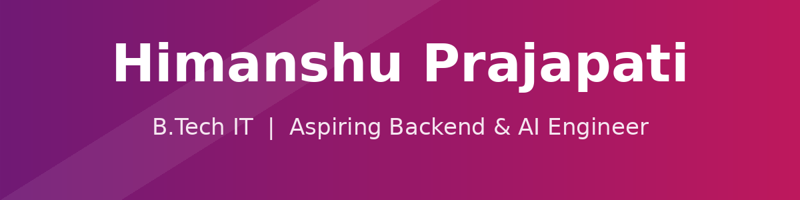

[](https://github.com/Himanshu-Prajapati-25)

[](https://www.linkedin.com/in/himanshuprajapati2025)
[](mailto:hp5122006@gmail.com)
[](https://www.instagram.com/iam.himanshu.0)

## 🧭 About Me

```yaml
name: Himanshu Prajapati
role: Aspiring Backend & AI Engineer
education: B.Tech in Information Technology
college: Chaudhary Charan Singh University, Meerut
team:
  - Technical Progress Head & Backend/AI Developer @ Team StackVolt
current_focus:
  - Python, Django, PyTorch, NumPy
  - DSA with Python
  - Responsive Web Projects
  - Git / GitHub workflows
long_term_interests:
  - Artificial Intelligence
  - Machine Learning / AI
  - Large Language Models (LLMs)
  - Backend & AI Development
philosophy: "Continuous learning, clean code, and growth through collaboration."
```

- 🎓 B.Tech in Information Technology, Chaudhary Charan Singh University, Meerut
- 🤝 **Technical Progress Head & Backend/AI Developer** at **Team StackVolt**
- 💻 Building backend systems and exploring AI-driven applications
- 🏆 Active hackathon contributor — sharpening backend architecture & problem-solving under deadlines
- 🌱 Currently strengthening: Python, Django, DSA, PyTorch, NumPy
- 🎯 Long-term goal: become a strong Backend & AI Engineer, contribute to open source, and build impactful products
- ✨ I value consistency, clear communication, and quality over quantity

## 🛠️ Tech Stack


**Languages:**


**Tools:**


**Learning Now:**


**Exploring:**


## 🚀 Featured Project

### AITELLION

AI-powered business management platform for Indian MSMEs — CRM, sales, inventory, HR, finance & invoicing under a single conversational AI interface.

**Team StackVolt · Hackathon Project**

<p align="right"><em>📅 Last Updated: August 12, 2026</em></p>

## 📊 GitHub Stats


### 👥 Followers & Following

[](https://github.com/Himanshu-Prajapati-25?tab=followers)
[](https://github.com/Himanshu-Prajapati-25?tab=following)

*(These badges pull live data from the GitHub API each time they're viewed — no manual updates needed.)*

## 🤝 Let's Connect

I'm always open to hackathon teams, open-source collaboration, and backend/AI internship opportunities.

[](https://www.linkedin.com/in/himanshuprajapati2025)
[](mailto:hp5122006@gmail.com)
[](https://www.instagram.com/iam.himanshu.0)

[](#)
